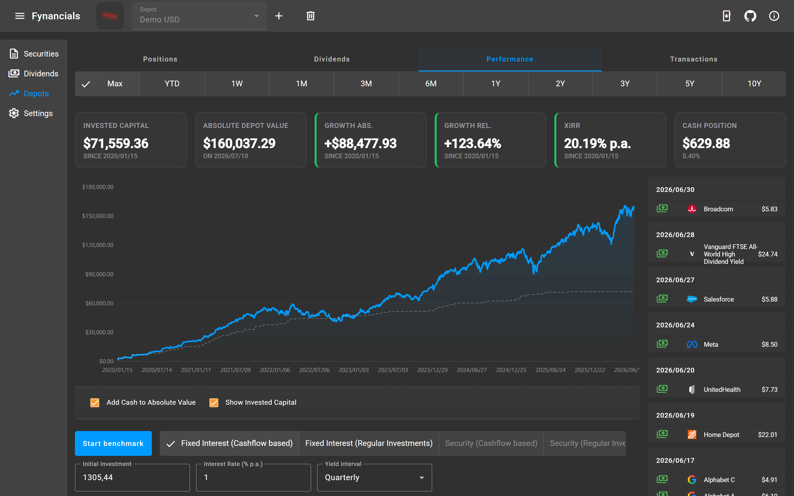
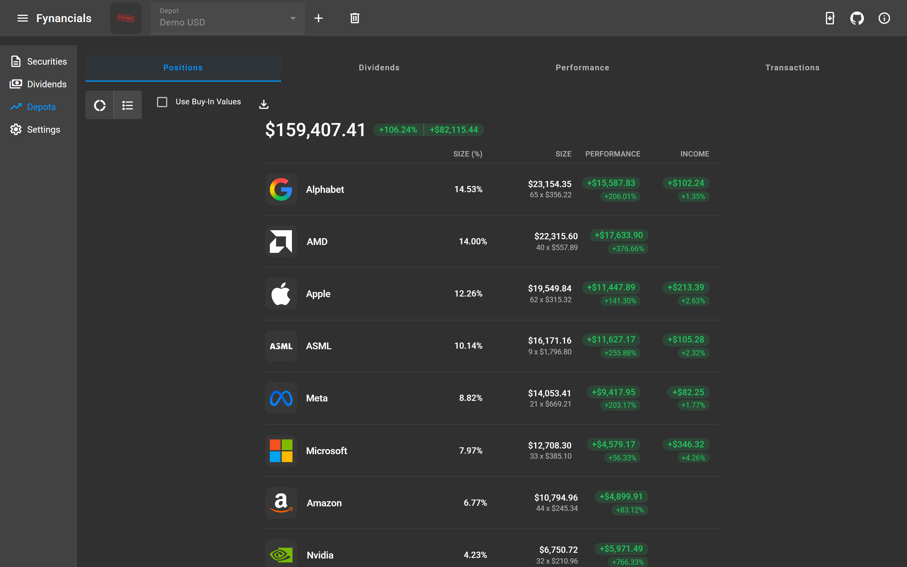
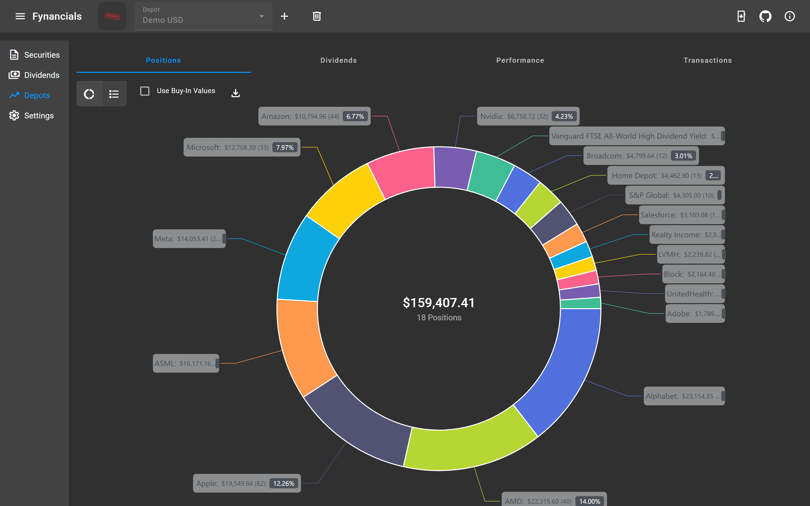
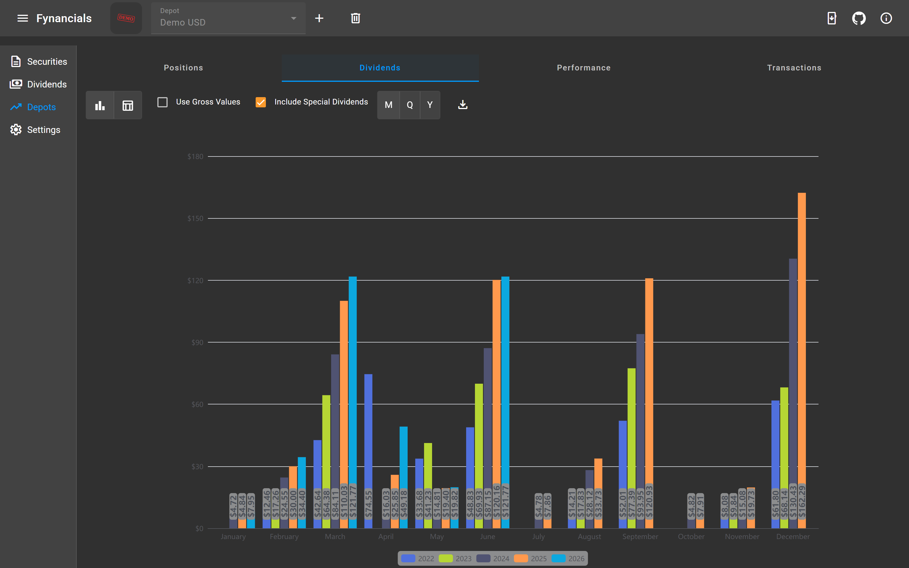
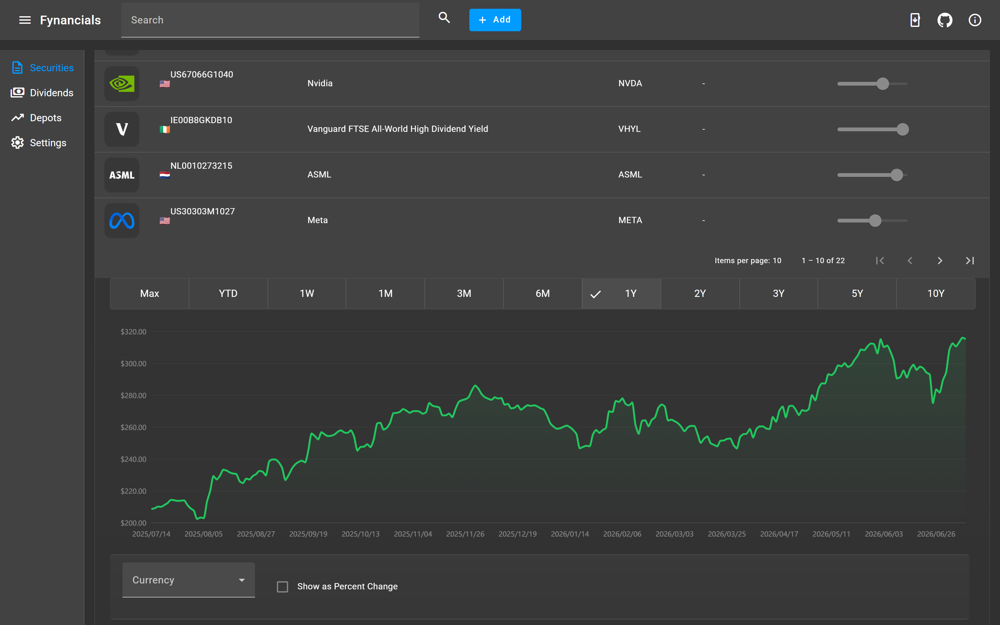

# Fynancials

Local-first portfolio tracking for the desktop. Fynancials keeps your complete investment
history — depots, transactions, dividends, performance — in an AES-encrypted database on your
own machine. No account, no cloud, no telemetry: the only network traffic is fetching market
data from sources you configure yourself. And a request to GitHub itself on application startup
to check for available updates.



## Features

- **Depots & transactions** — track any number of depots; record buys, sells, dividends,
  special dividends, and taxes manually or through a CSV import wizard.
- **Performance analysis** — depot value over time, invested capital, XIRR (annualized
  money-weighted return), and configurable benchmarks: "what if I had put the same money into
  another financial instrument instead?"
- **Positions** — per-holding returns, drill-down into individual purchase lots, allocation
  chart.
- **Dividends** — per-depot dividend history and yield tables, plus a calendar of upcoming
  dividend announcements with in-app notifications.
- **Securities** — master data, stock splits, and historical price charts for every security
  you track.
- **Bring-your-own market data** — historical prices and dividend announcements are pulled from
  HTTP/JSON APIs you configure declaratively (URL, JSON paths, date formats, market closing
  times). The app comes with preconfigured historical price sources — just add your own API
  key. Exchange rates come from the official ECB reference rates, so multi-currency depots are
  converted with daily precision.
- **Privacy by design** — password-protected, AES-encrypted local database; a "hide absolute
  values" mode for sharing your screen without sharing your net worth.

<p>
  
  
</p>
<p>
  
  
</p>

## Getting started

Users: see the [user manual](./USER_MANUAL.md) for installation, database setup, and a feature walkthrough.

You can download Fynancials from the [GitHub Releases page](https://github.com/aslopek/fynancials/releases).

### Build from source

Prerequisites: Java 25, Maven 3.9+, Node.js 24.

```shell
git clone https://github.com/aslopek/fynancials.git
cd fynancials/fynancials-server-spring
mvn clean package
cd ../fynancials-client-angular
npm ci
npm run build
npm run electron:pack
```

For development, run the backend directly (`mvn spring-boot:run -Dspring-boot.run.profiles=dev`)
and the frontend via `npm run serve` on `http://localhost:4200`. API changes start in
`fynancials-api`; both sides regenerate their clients/delegates from the specs
(`npm run generate` / `mvn generate-sources`). See `LLM.md` for the full development workflow.

## How it's built

An OpenAPI-first monorepo with three parts:

| Part                        | Role                                                                                 |
|-----------------------------|--------------------------------------------------------------------------------------|
| `fynancials-api`            | OpenAPI 3 specs — the single source of truth for every HTTP API, one spec per domain |
| `fynancials-client-angular` | Angular + NgRx frontend, packaged as the Electron desktop app                        |
| `fynancials-server-spring`  | Spring Boot (Java 25) backend, bundled into the desktop app as `backend.jar`         |

At runtime, the Electron main process spawns the Spring Boot backend as a local child process
(`127.0.0.1:23726`) and points the Angular UI at it. Data lives in a single encrypted H2 file
database, schema-managed by Liquibase.

### The domain is the unit, not the layer

One idea carries through the whole stack: `fynancials-api` splits the HTTP surface into one
OpenAPI spec per domain (`depot`, `depot-transaction`, `security`,
`historical-security-price`, ...), and that split propagates straight down. The backend mirrors
it as one package per domain — each a self-contained vertical slice of controller → service →
repository → entity with its own MapStruct mapper — and the frontend mirrors it again with one
NgRx store slice and one feature folder per domain. Domains don't share internals; only clearly
defined interfaces cross the boundary.

Holding that seam open costs some repeated mapping and plumbing code across domains. That's
deliberate: any domain can be read, understood, and changed end to end without detouring
through shared base classes that couple it to everything else. And because both the Angular
client and the Spring server generate their API layer from the very same specs, the boundary
is enforced structurally, not by convention — frontend and backend cannot drift out of sync
on request/response shapes.

### Testing

Backend testing centers on integration tests: every API endpoint has its own test class (e.g.
`CreateTransactionTest`, `GetDepotPerformanceTest`) driving the real Spring context through
MockMvc — real controllers, services, and H2 database, with outbound third-party calls (e.g.
ECB exchange rates) stubbed at the edge. Every endpoint is verified against actual persistence
and real payloads, not mocks standing in for the components that matter.

Frontend tests are a known gap — there are currently no `*.spec.ts` files. The priority so far
has been the backend, where the actual portfolio calculations live; component and store tests
are the next area to invest in.

## Security model

Fynancials is a **single-user local desktop application**, and its security model is built on
that assumption: the backend binds to `127.0.0.1` only, CORS is restricted to the bundled app
and the local dev server, the database is an encrypted local file, and there is no
authentication layer — on a single-user machine, the only thing that can reach the port is the
user's own Electron app. The database connection details are only exposed to the UI when the
user explicitly enables dev mode.

Those trade-offs are sound locally but mean `fynancials-server-spring` is **not suitable to
deploy as a hosted service as-is**. That would require, at minimum: authentication/
authorization, per-tenant data isolation instead of one embedded H2 file, TLS, a real CORS/
network exposure policy, disabling the H2 console or entirely switching the database, proper
secrets management, rate limiting, audit logging, and compliance with the terms of the
third-party data sources being queried. Until then, treat the backend strictly as a local
companion process of the desktop app.

## Changelog

See [CHANGELOG.md](./CHANGELOG.md) for notable changes.

## Contributing

Feature requests and bug reports are welcome as GitHub issues; pull requests are not accepted — see [CONTRIBUTING.md](./CONTRIBUTING.md).

Please refer to [SECURITY.md](./SECURITY.md) for guidance on how to report vulnerabilities.

## License

MIT — see [LICENSE](./LICENSE). The "Fynancials" name and logo files are excluded from the license;
see the exception note in the LICENSE file. Third-party attributions are shown in the app's
About dialog.
